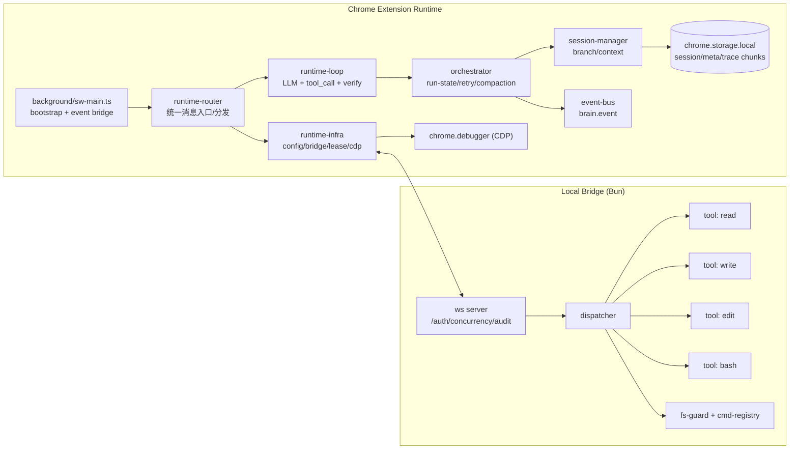
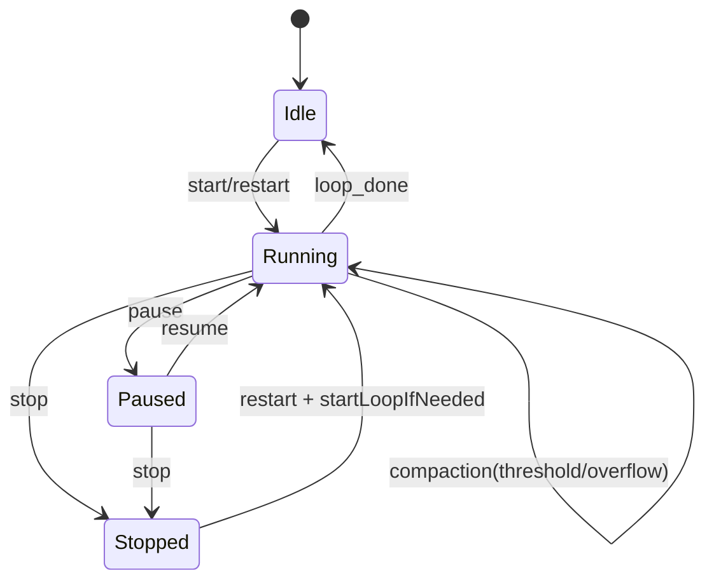

# Browser Brain Loop 非 UI 架构蓝图（可复刻）

> 锚点约定：本文使用 `path::symbol`，避免 `:line` 因代码移动导致失效。

## 1. 设计铁律

- 大脑永远在浏览器侧（Service Worker Kernel），本地 Bridge 只做执行代理。
- 协议先行：所有能力都经消息协议暴露，不通过“直接函数调用”跨层耦合。
- 存储可恢复：会话正文与元数据分离，trace 分块持久化，支持重启恢复。

对应实现锚点：
- `extension/src/background/sw-main.ts::bootstrapSessionStore + registerRuntimeRouter`
- `extension/src/sw/kernel/runtime-router.ts::registerRuntimeRouter`
- `bridge/src/server.ts::startBridgeServer`

## 2. 组件分层图（非 UI）



关键文件：
- `extension/src/sw/kernel/runtime-infra.browser.ts::createRuntimeInfraHandler.handleMessage`
- `extension/src/sw/kernel/runtime-loop.browser.ts::runAgentLoop`
- `extension/src/sw/kernel/orchestrator.browser.ts::BrainOrchestrator`
- `bridge/src/dispatcher.ts::dispatchInvoke`

## 3. 关键时序：`brain.run.start` 到 tool_call 闭环

```mermaid
sequenceDiagram
  participant Caller as Runtime Caller
  participant Router as runtime-router
  participant Loop as runtime-loop
  participant Orch as orchestrator
  participant Infra as runtime-infra
  participant LLM as LLM API
  participant Bridge as Bun Bridge
  participant CDP as chrome.debugger
  participant Store as session-store

  Caller->>Router: brain.run.start(sessionId?, prompt, tabIds?)
  Router->>Loop: startFromPrompt(...)
  Loop->>Store: append user message / optional sharedTabs metadata
  Loop->>Orch: setRunning(true) + emit loop_start

  loop 每轮直到完成/失败/max_steps/stopped
    Loop->>LLM: /chat/completions(messages + tools)
    LLM-->>Loop: assistant content + tool_calls?
    alt 有 tool_calls
      Loop->>Infra: executeStep(mode=bridge/cdp)
      alt bridge 工具
        Infra->>Bridge: invoke(tool,args)
        Bridge-->>Infra: ok/data 或 error
      else cdp 工具
        Infra->>CDP: snapshot/action/verify
        CDP-->>Infra: observation/result
      end
      Loop->>Store: append tool message
    else 无 tool_calls
      Loop->>Store: append assistant message
    end
  end

  Loop->>Orch: setRunning(false) + emit loop_done
```

关键文件：
- `extension/src/sw/kernel/runtime-router.ts::handleBrainRun`
- `extension/src/sw/kernel/runtime-loop.browser.ts::startFromPrompt`
- `extension/src/sw/kernel/runtime-loop.browser.ts::requestLlmWithRetry`
- `extension/src/sw/kernel/runtime-loop.browser.ts::executeToolCall`

## 4. 协议蓝图

### 4.1 Runtime（extension 内部消息）

- 入口路由：`runtime-router` 按前缀分发  
  `brain.run.* / brain.session.* / brain.step.* / brain.storage.* / brain.debug.*`
- 实现：
  - `brain.run.start/regenerate/pause/resume/stop`：`extension/src/sw/kernel/runtime-router.ts::handleBrainRun`
  - `brain.session.fork/list/view/delete/title.refresh`：`extension/src/sw/kernel/runtime-router.ts::handleSession`
  - `brain.step.execute/stream`：`extension/src/sw/kernel/runtime-router.ts::handleStep`

### 4.2 Bridge WS（Browser ↔ Bun）

- 请求帧：`{ type:"invoke", id, tool, args, sessionId?, parentSessionId?, agentId? }`
- 响应帧：`{ id, ok:true, data }` / `{ id, ok:false, error }`
- 事件帧：`invoke.started|stdout|stderr|finished`
- 解析与校验：`bridge/src/protocol.ts::parseInvokeFrame`
- 发送与并发控制：`bridge/src/server.ts::startBridgeServer(websocket.message)`

## 5. 存储模型（可直接复刻）

键空间（`chrome.storage.local`）：

- `session:index`
- `session:{sessionId}:meta`
- `session:{sessionId}:entries:{chunk}`
- `trace:{traceId}:{chunk}`

实现锚点：
- `extension/src/sw/kernel/session-store.browser.ts::SESSION_INDEX_KEY + buildSessionMetaKey/buildSessionEntriesChunkKey/buildTraceChunkKey`
- `extension/src/sw/kernel/session-store.browser.ts::initSessionStorage + readSessionMeta/writeSessionMeta`
- `extension/src/sw/kernel/session-store.browser.ts::appendSessionEntry + readAllSessionEntries`

会话上下文恢复逻辑：

- 按 `leafId` 回溯 branch：`extension/src/sw/kernel/session-manager.browser.ts::getBranch`
- 读取最近 compaction summary 注入 system：`extension/src/sw/kernel/session-manager.browser.ts::buildSessionContext`

## 6. 运行状态机（Orchestrator）



实现锚点：
- `extension/src/sw/kernel/orchestrator.browser.ts::pause/resume/stop/restart/setRunning`
- `extension/src/sw/kernel/orchestrator.browser.ts::handleAgentEnd + runCompaction`
- `extension/src/sw/kernel/runtime-loop.browser.ts::startLoopIfNeeded`

## 7. 错误码与降级策略

Bridge 错误码：

- `E_ARGS`：参数/帧格式错误（`bridge/src/protocol.ts::parseInvokeFrame + as* validators`）
- `E_TOOL`：未知工具（`bridge/src/protocol.ts::parseInvokeFrame`）
- `E_PATH`：路径或 cwd 拒绝（`bridge/src/fs-guard.ts::FsGuard.assertAllowed`）
- `E_CMD`：命令不在白名单或 strict 禁止（`bridge/src/cmd-registry.ts::resolveCommand`）
- `E_BUSY`：并发上限（`bridge/src/server.ts::startBridgeServer(websocket.message)`）
- `E_TIMEOUT`：bash 超时（`bridge/src/tools/bash.ts::runBash`）

Kernel 降级：

- 缺少 LLM 配置：直接 `llm.skipped` + `loop_done(done)`  
  `extension/src/sw/kernel/runtime-loop.browser.ts::runAgentLoop(missing_llm_config)`
- LLM 重试：指数退避 + 事件可观测  
  `extension/src/sw/kernel/runtime-loop.browser.ts::requestLlmWithRetry`
- 执行 fallback：`script -> cdp`  
  `extension/src/sw/kernel/runtime-loop.browser.ts::executeStep`

## 8. 复刻清单（给另一个 AI）

1. 先实现 Bridge（鉴权、并发上限、invoke 分发、事件流）。
2. 在扩展 SW 实现三层 kernel：`runtime-router`、`runtime-infra`、`runtime-loop`。
3. 用 `orchestrator + session-store` 管理 run-state、retry、compaction、trace。
4. 只允许 runtime-loop 发起 LLM；只允许 runtime-infra 访问 CDP/Bridge。
5. 按 BDD 门禁跑：`brain:e2e` -> `bdd:validate` -> `bdd:gate`。

最小必备文件集：
- `bridge/src/server.ts`
- `bridge/src/dispatcher.ts`
- `bridge/src/protocol.ts`
- `extension/src/background/sw-main.ts`
- `extension/src/sw/kernel/runtime-router.ts`
- `extension/src/sw/kernel/runtime-infra.browser.ts`
- `extension/src/sw/kernel/runtime-loop.browser.ts`
- `extension/src/sw/kernel/orchestrator.browser.ts`
- `extension/src/sw/kernel/session-store.browser.ts`

## 9. 延伸阅读

如需查看与 pi-mono 的逐维对比与迁移建议，请参考：
- `docs/pi-mono-runtime-comparison.md`
